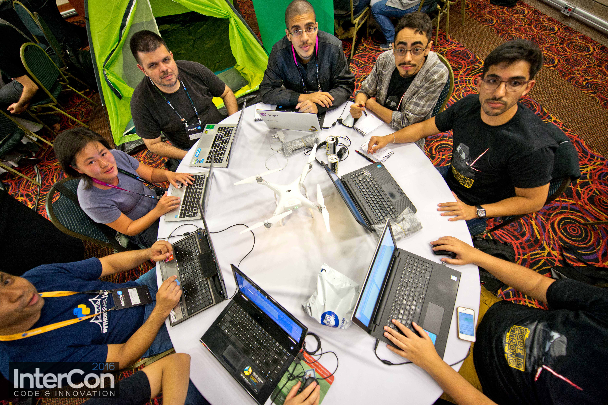
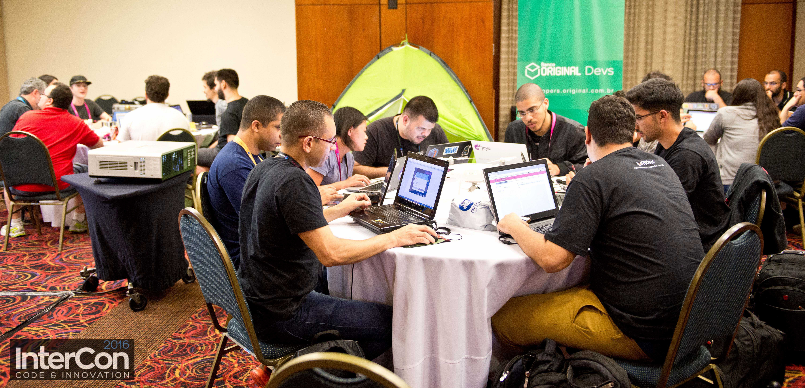

#VSLIDE

#### Maratona Hacker Cívica - Intercon 2016

#VSLIDE

# <b>A Maratona</b>

 

#VSLIDE

# <b>A Maratona</b>
 
### Madrugada entre os 2 dias do evento
### + de 8 horas codando
### Desenvolver projeto para facilitar acesso à serviços essenciais do governo

#VSLIDE

# <b>A Equipe</b>

 

#VSLIDE

# <b>A Equipe</b>

             
             <b>
             Edmar Inocencio
             </b>
             
             
             <b>
             Fabricio Biazzotto
             </b>
             
             
             <b>
             Patricia Morimoto
             </b>
             
             
             <b>
             Regis da Silva Santos
             </b>
             
             
             <b>
             Rodrigo Gomes da Silveira
             </b>
             

#VSLIDE

# <b>O Projeto</b>

 

#VSLIDE

# <b>O Projeto</b>

## Dados do TSE - Eleições 2016 São Paulo

             
             <b>
             Votos Válidos Candidatos São Paulo
             </b>
             
             
             <b>
             X
             </b>
             
             
             <b>
             Perfil dos Eleitores
             </b>
             

#VSLIDE

# <b>O Projeto</b>

             
             
             
             
             
             
             
             
             Bootstrap
             
             
             
             
             

  repositório: https://github.com/rg3915/maratona-intercon2016

